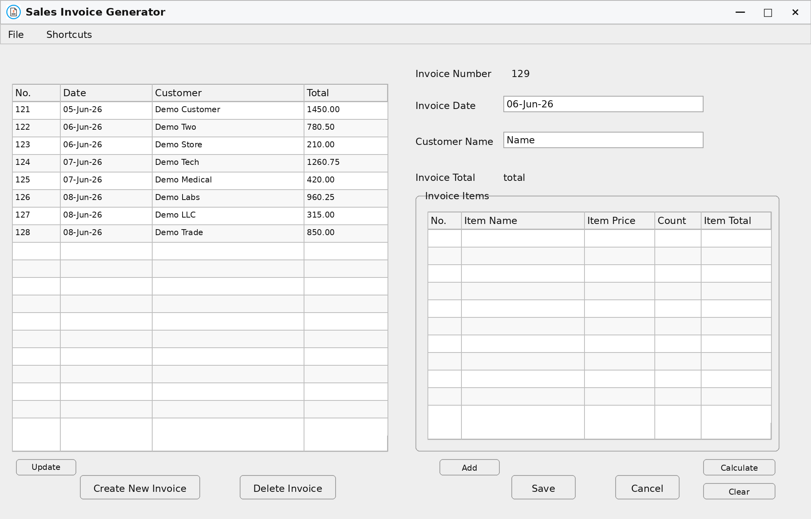
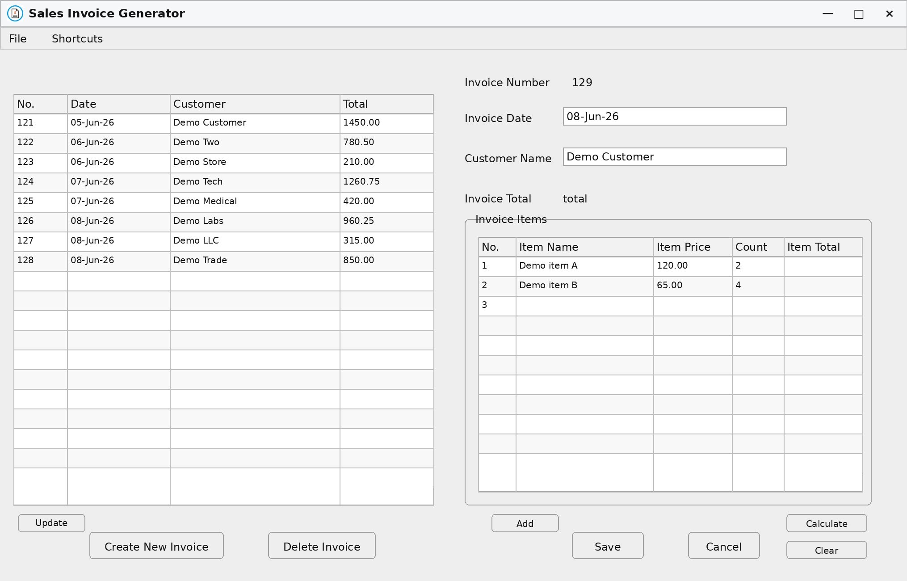
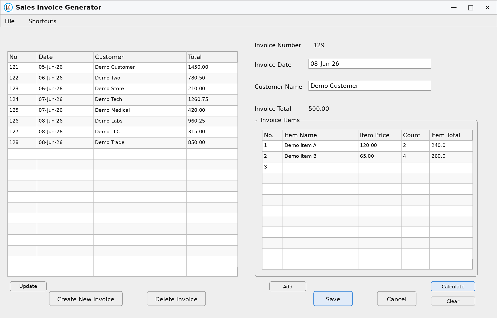
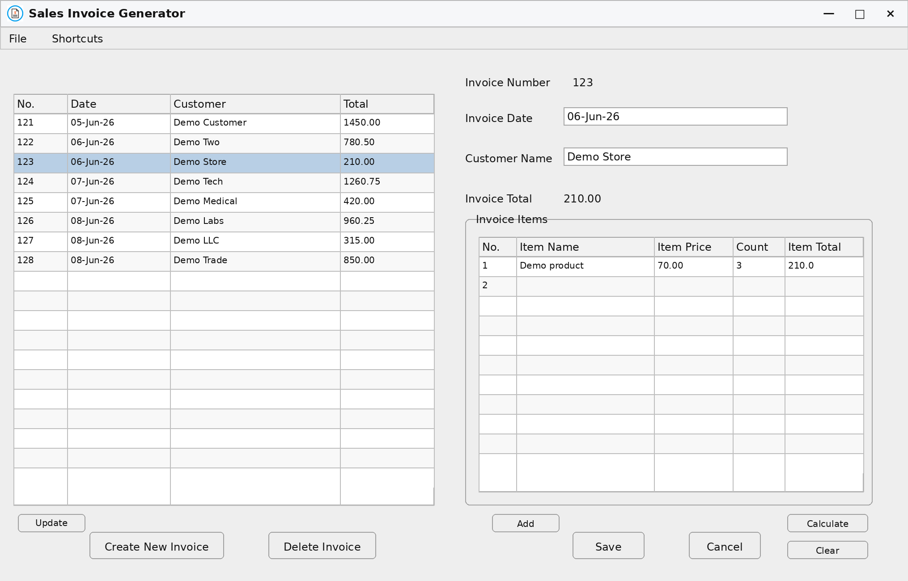
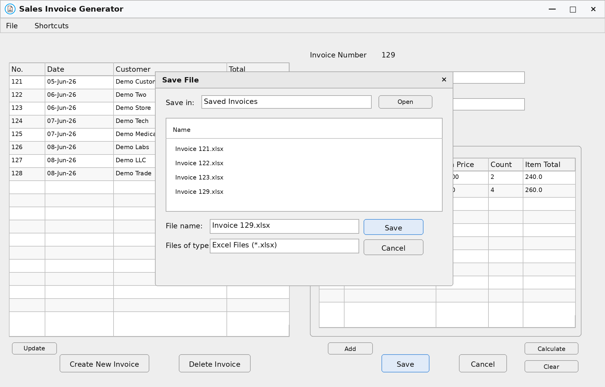
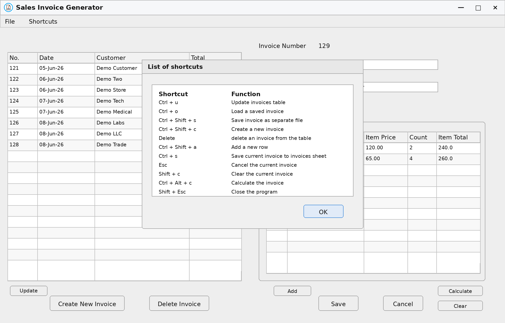

# Sales Invoice Generator

Sales Invoice Generator is a Java Swing desktop application to generate, load, edit, calculate, save, delete and export sales invoice. The application stores invoice data in Excel workbooks and uses Apache POI to work with `.xlsx` files.

## Preview



The main interface shows the loaded invoices table on the left and the invoice editor on the right.



The invoice form has fields to enter customer information, date of invoice, item names, item prices and item counts.



The application calculates item totals and the final invoice total before saving.



Saved invoice records can be loaded back into the interface for review or editing.



The application can export an invoice as a separate Excel workbook.



A shortcuts dialog lists keyboard commands for common actions.

## Main Features

* Java Swing desktop graphical interface
* Invoice creation, editing, loading, saving, updating, deletion, and export
* Invoice summary table and invoice item table
* Automatic sales invoice calculation
* Excel workbook processing using Apache POI
* Export saved-invoice as a separate excel file
* Keyboard shortcuts for common application actions
* Basic validation for invoice dates, customer names, item prices, and item counts

## Technical Overview

The project is organized as a Java desktop application with separate view, controller, model, and shared-state classes. The Swing interface is built manually with `JFrame`, `JPanel`, `JTable`, `JScrollPane`, `JButton`, `JTextField`, menus, dialogs, and keyboard shortcuts.

The controller manages file operations and updates Excel workbooks. It reads and writes invoice summaries, invoice details and separately exported invoices using Apache POI. The model has helper methods for clearing the invoice form, validating dates and names, validating numeric inputs, and updating the current invoice number.

The application keeps its workbook files in the project root.

## How to Run

Install Java and Maven, then run from the project root:

```bash
mvn compile exec:java
```

The following files and folders should remain in the project root because the original implementation reads and writes them relative to the working directory:

```text
Invoices.xlsx
Invoices Details.xlsx
Invoice Number.txt
Saved Invoices/
Shortcuts.txt
icon.jpg
```

## Project Structure

```text
src/main/java/com/Controller/       Controller logic and workbook operations
src/main/java/com/Model/            Validation and helper logic
src/main/java/com/View/             Java Swing user interface
src/main/java/com/Common.java       Shared UI components, actions, constants, and state
Saved Invoices/                     Saved invoice examples
Invoices.xlsx                       Main invoice summary workbook
Invoices Details.xlsx               Invoice details workbook
Invoice Number.txt                  Current invoice-number tracker
Shortcuts.txt                       Keyboard shortcut reference
icon.jpg                            Application icon
pom.xml                             Maven configuration
```

## Limitations

This is a simple desktop invoice management project based on local Excel workbooks, it is not using a backend databse, and it is not intended to be a practical invoice management product.
